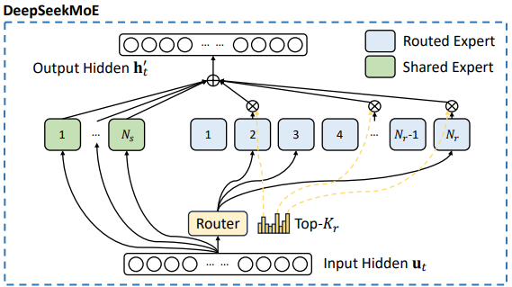

# DeepSeekMoE with Auxiliary-Loss-Free Load Balancing

- **DeepSeekMoE architecture** — finer-grained experts with $N_s$ shared experts and $N_r$ routed experts
- **Auxiliary-loss-free load balancing** — per-expert bias terms for routing decisions
- **Complementary sequence-wise auxiliary loss** — prevents extreme intra-sequence imbalance

---

## Architecture



The input hidden state $\mathbf{u}_t$ is processed by:
- **$N_s$ shared experts** — always active for every token
- **$N_r$ routed experts** — top-$K_r$ selected per token via the Router

Their outputs are summed to produce the output hidden state $\mathbf{h}'_t$.

---

## 1. Expert FFN (SwiGLU)

Each expert (shared or routed) is a Feed-Forward Network with SiLU-gated linear units:

$$\text{FFN}(\mathbf{x}) = W_{\text{down}} \left( \text{SiLU}(W_{\text{gate}}\,\mathbf{x}) \odot W_{\text{up}}\,\mathbf{x} \right)$$

```python
class Expert(nn.Module):
    def __init__(self, hidden_dim: int, intermediate_dim: int):
        super().__init__()
        self.gate_proj = nn.Linear(hidden_dim, intermediate_dim, bias=False)
        self.up_proj   = nn.Linear(hidden_dim, intermediate_dim, bias=False)
        self.down_proj = nn.Linear(intermediate_dim, hidden_dim, bias=False)

    def forward(self, x: torch.Tensor) -> torch.Tensor:
        return self.down_proj(F.silu(self.gate_proj(x)) * self.up_proj(x))
```

---

## 2. Top-K Router with Auxiliary-Loss-Free Load Balancing

### Affinity Score

Sigmoid dot-product between each token and each expert centroid:

$$s_{i,t} = \text{Sigmoid}(\mathbf{u}_t^\top \mathbf{e}_i)$$

### Top-K Routing

Select the $K_r$ experts with the highest (biased) affinity per token:

$$g'_{i,t} = \begin{cases} s_{i,t}, & s_{i,t} + b_i \in \text{Topk}(\{s_{j,t} + b_j \mid 1 \leqslant j \leqslant N_r\},\, K_r) \\ 0, & \text{otherwise} \end{cases}$$

The bias term $b_i$ is used **only for routing** — the gating value always uses the original $s_{i,t}$.

### Gating Value

Normalize the selected affinities:

$$g_{i,t} = \frac{g'_{i,t}}{\sum_{j=1}^{N_r} g'_{j,t}}$$

### Bias Update (Auxiliary-Loss-Free)

After each training step, adjust $b_i$ based on actual token counts:

$$b_i \mathrel{-}= \gamma \quad \text{if overloaded}, \qquad b_i \mathrel{+}= \gamma \quad \text{if underloaded}$$

```python
class TopKRouter(nn.Module):
    def forward(self, u: torch.Tensor):
        affinity_scores = torch.sigmoid(self.centroids(u))       # Eq 2: sigmoid affinity
        biased_scores   = affinity_scores + self.expert_bias     # Eq 5: add bias for routing
        _, topk_indices = torch.topk(biased_scores, self.top_k, dim=-1)  # Eq 3: top-K select

        selected_affinities = affinity_scores.gather(-1, topk_indices)   # original scores
        gate_values = selected_affinities / (selected_affinities.sum(dim=-1, keepdim=True) + 1e-9)

        return gate_values, topk_indices, affinity_scores

    @torch.no_grad()
    def update_bias(self, expert_counts: torch.Tensor, target_count: float):
        self.expert_bias -= self.bias_update_speed * (expert_counts > target_count).float()
        self.expert_bias += self.bias_update_speed * (expert_counts < target_count).float()
```

---

## 3. DeepSeekMoE Layer

### MoE FFN Output

Residual connection + always-on shared experts + sparsely-gated routed experts:

$$\mathbf{h}'_t = \mathbf{u}_t + \sum_{i=1}^{N_s} \text{FFN}_i^{(s)}(\mathbf{u}_t) + \sum_{i=1}^{N_r} g_{i,t}\, \text{FFN}_i^{(r)}(\mathbf{u}_t)$$

```python
# Shared experts — always active
shared_output = sum(expert(u) for expert in self.shared_experts)

# Routed experts — sparse dispatch
flat_u, flat_gate, flat_indices = u.view(-1, D), gate_values.view(-1, K), expert_indices.view(-1, K)
flat_output = torch.zeros_like(flat_u)

for k in range(self.top_k):
    for i in range(self.num_routed_experts):
        mask = (flat_indices[:, k] == i)
        if mask.any():
            flat_output[mask] += flat_gate[mask, k].unsqueeze(-1) * self.routed_experts[i](flat_u[mask])

h_prime = u + shared_output + flat_output.view(B, T, D)
```

---

## 4. Sequence-Wise Auxiliary Balance Loss

Penalizes over-reliance on any single expert **within a sequence**. Works alongside the bias update which handles global balance across batches.

### Expert Frequency $f_i$

Fraction of tokens in the sequence that selected expert $i$ (normalized so perfect balance = 1.0):

$$f_i = \frac{N_r}{K_r T} \sum_{t=1}^{T} \mathbb{1}\!\left(s_{i,t} \in \text{Topk}(\{s_{j,t}\},\, K_r)\right)$$

### Expert Score Mass $P_i$

Average normalized affinity toward expert $i$ across the sequence (differentiable):

$$s'_{i,t} = \frac{s_{i,t}}{\sum_{j=1}^{N_r} s_{j,t}}, \qquad P_i = \frac{1}{T} \sum_{t=1}^{T} s'_{i,t}$$

### Balance Loss

$$\mathcal{L}_{\text{Bal}} = \alpha \sum_{i=1}^{N_r} f_i\, P_i$$

$f_i$ acts as a **scaling factor** on the gradient — overused experts receive a larger gradient, pushing `centroids.weight` to reduce their affinity.

```python
def _sequence_wise_balance_loss(self, affinity_scores, expert_indices):
    B, T, N_r = affinity_scores.shape

    # f_i: selection frequency, normalized (no gradient)
    one_hot = F.one_hot(expert_indices, num_classes=N_r).float().sum(dim=2)  # (B, T, N_r)
    f = (N_r / (self.top_k * T)) * one_hot.sum(dim=1)                       # (B, N_r)

    # P_i: mean normalized affinity (has gradient → flows to centroids.weight)
    s_prime = affinity_scores / (affinity_scores.sum(dim=-1, keepdim=True) + 1e-9)
    P = s_prime.mean(dim=1)                                                  # (B, N_r)

    return (self.balance_alpha * (f * P).sum(dim=-1)).mean()
```

---

## Two Load Balancing Mechanisms

| | Sequence-Wise Loss | Bias Update |
|---|---|---|
| **Scope** | Within 1 sequence | Across entire batch |
| **Updates** | `centroids.weight` via backprop | `expert_bias` via manual rule |
| **Speed** | Slow (learning rate) | Fast (every step, fixed $\gamma$) |
| **Fixes** | Intra-sequence collapse | Global/inter-sequence collapse |

A model can be *locally balanced but globally skewed*, or *globally balanced but locally collapsed*.
